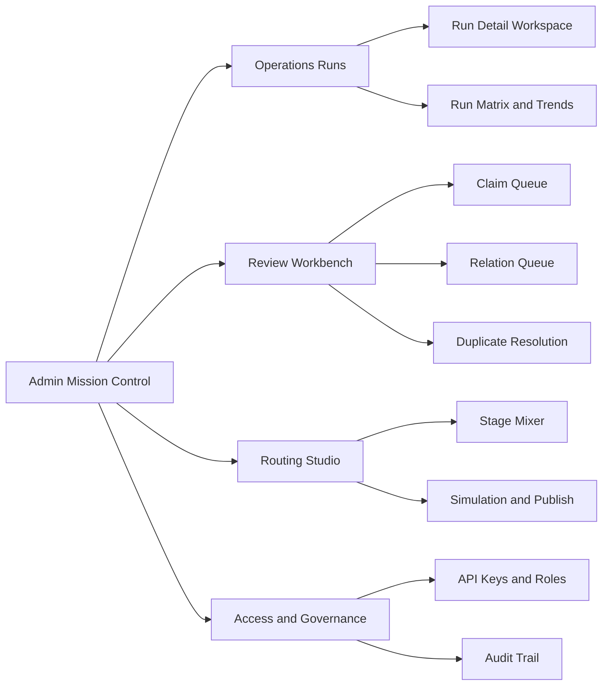

# Sophia Admin Hub Redesign Brief

Date: 2026-03-20

## Ten-minute first-run track (narrow scope)

Product direction: **default experience = few questions, few options**, advanced tools available but not in the critical path. See **[dashboard-ten-minute-experience.md](./dashboard-ten-minute-experience.md)** and in-app **`/admin/quick-start`**.

## Goal

Make Sophia's administration experience feel like a best-in-class operator cockpit rather than a set of disconnected utility pages.

The admin surface should help an operator answer five questions quickly:

1. What needs attention now?
2. What is running, blocked, or failing?
3. What decision do I need to make next?
4. What configuration am I changing, and how risky is it?
5. What happened, and who changed it?

## Current state audit

Reviewed surfaces:

- `/Users/adamboon/projects/sophia/src/routes/admin/+page.svelte`
- `/Users/adamboon/projects/sophia/src/routes/admin/operations/+page.svelte`
- `/Users/adamboon/projects/sophia/src/routes/admin/review/+page.svelte`
- `/Users/adamboon/projects/sophia/src/routes/admin/ingestion-routing/+page.svelte`
- `/Users/adamboon/projects/sophia/src/styles/design-tokens.css`

### What is not working

#### 1. Too much of the admin experience is styled like forensic detail

Monospace, muted text, dark cards, and border-only separation dominate almost every admin surface. This makes overview content, launch actions, and raw diagnostic material look too similar.

Effect:

- hard to tell "where to act" versus "where to inspect"
- pages feel heavier than they need to
- useful information does not pop

#### 2. The token contract is being violated on small text

`/Users/adamboon/projects/sophia/src/styles/design-tokens.css` documents `--color-dim` as below 4.5:1 contrast for normal text and suitable only for large text or UI components. The admin pages still use dim text on small metadata, especially in the operations list and other support copy.

Effect:

- metadata becomes hard to read
- the interface feels washed out under real operator use

#### 3. The current IA mixes mission control, command console, and documentation

The main admin page is an overview plus access panel plus key management table.
The operations page is a JSON launcher, queue, and run detail page at once.
The ingestion routing page is currently a status memo, not an operational workspace.

Effect:

- each page is trying to be too many things
- the operator has to reconstruct the mental model themselves

#### 4. The most important flows still rely on expert-only affordances

The operations console currently treats raw JSON as the primary launch interface.
That is acceptable for a debugging backdoor, but not for a best-in-class operator experience.

Effect:

- high cognitive load
- high fear of making mistakes
- weak discoverability for valid options

#### 5. Review work is powerful but not yet workbench-shaped

The review queue has rich data, but it is still mostly a long vertical stack of cards with inline controls.

Effect:

- triage speed is limited
- comparing items and staying in context is harder than it should be
- audit and decision detail are not visually separated enough from the queue itself

## External patterns worth borrowing

### GitHub Actions

Source: [Using the visualization graph](https://docs.github.com/en/actions/how-tos/monitor-workflows/use-the-visualization-graph)

Pattern to borrow:

- every run gets a real-time dependency graph
- clicking a node moves directly into the relevant logs

Sophia implication:

- each ingestion run should have a stage graph or stage strip
- logs should hang off the selected stage, not live as a detached blob of text

### GitLab Pipeline Editor

Source: [Pipeline editor](https://docs.gitlab.com/ci/pipeline_editor/)

Pattern to borrow:

- validate while editing
- provide a visualized configuration view
- provide a full machine-readable view

Sophia implication:

- when Restormel is ready, the routing editor should include validate, visualize, and raw config modes

### Apache Airflow

Source: [UI Overview](https://airflow.apache.org/docs/apache-airflow/stable/ui.html)

Pattern to borrow:

- health-first home page
- list view with filters and recent activity
- grid view for repeated-run diagnosis
- graph view for dependency reasoning
- detail tabs for runs, tasks, events, code, and metadata

Sophia implication:

- admin home should become Mission Control
- operations should expose both per-run detail and cross-run failure patterns

### Jenkins Blue Ocean

Source: [Blue Ocean](https://www.jenkins.io/doc/book/blueocean/)

Pattern to borrow:

- re-center the experience around the pipeline itself
- reduce clutter and improve clarity
- highlight where intervention is needed

Sophia implication:

- ingestion, review, and governance should be the central themes of the admin experience
- the interface should feel like a workflow product, not a developer scratchpad

### Datadog Workflow Automation

Source: [Workflow Automation](https://www.datadoghq.com/product/workflow-automation/)

Pattern to borrow:

- workflow builder and execution debugger are both first-class
- human decisions and RBAC are part of the workflow model

Sophia implication:

- human approvals, policy checks, and route choices should feel native to the admin workflow, not bolted on

### Vercel Tracing

Source: [Tracing](https://vercel.com/docs/tracing)

Pattern to borrow:

- represent one request as a timeline of spans
- keep detail in a sidebar tied to the selected span
- support zoom and focused inspection without losing the full story

Sophia implication:

- an ingestion run should read as a trace
- stage, provider, model, duration, cost, and fallback should be inspectable without leaving the run view

## Recommended information architecture

### 1. Mission Control

Purpose:

- high-level health
- what needs attention now
- current bottlenecks
- direct links into the relevant workspace

Content:

- queue counts
- recent failures
- stage health strip
- ingestion throughput trend
- review backlog
- access or policy alerts

### 2. Operations Runs

Purpose:

- launch and monitor operations
- inspect a selected run

Recommended layout:

- left: filters and run list
- center: run graph or stage strip plus summary
- right or lower inspector: logs, payload, events, lineage, policy detail

The JSON launcher should remain as an advanced mode, not the primary mode.

### 3. Review Workbench

Purpose:

- triage claims, relations, and duplicates quickly

Recommended layout:

- left: queue and filters
- center: evidence and source comparison
- right: decision controls, notes, blockers, audit context

This should feel closer to moderation tooling than to stacked cards.

### 4. Routing Studio

Purpose:

- future Restormel-backed routing control plane

Recommended layout once APIs are ready:

- stage list or stage tabs
- priority ladder for provider/model order
- cost chips and switchover rule summaries
- simulation panel
- validate / publish / rollback controls

### 5. Access and Governance

Purpose:

- keys, roles, entitlements, auditability

Recommended layout:

- operational summary at the top
- create / edit actions in a focused form
- audit log and history in a separate lower section or tab

## Visualization system

### Use these patterns

- `status strip`: stage health at a glance
- `timeline trace`: one run through time
- `dependency graph`: stage order and blockers
- `matrix heatmap`: failures or retries across runs and stages
- `priority ladder`: route or fallback order
- `split-view evidence comparison`: duplicate and review flows
- `ledger`: audit and history

### Do not use these as defaults

- stacked cards for every kind of data
- full-page raw logs
- full-page raw JSON
- tiny muted metadata as the only context cue

## Immediate design work Sophia can do before Restormel is ready

### Phase 1: shell and hierarchy

- add a persistent admin-local navigation model
- separate Mission Control from Operations, Review, Routing, and Governance
- reduce monospace outside logs, payloads, counts, and labels
- stop using low-contrast tertiary text for small metadata

### Phase 2: operations workspace

- replace the current launcher-first layout with run-first layout
- make operation templates guided rather than raw-first
- add run summaries, stage summaries, and a detail inspector
- create a cross-run matrix for status and failure patterns

### Phase 3: review workbench

- move from long vertical stacks to queue + evidence + decision layout
- add filters, keyboard-friendly triage, and stronger blocker summaries
- separate review notes from audit history visually

### Phase 4: routing studio prep

- design the future Restormel-backed mixer panel now
- do not implement local routing state as a substitute
- make sure the UX assumes validate, simulate, publish, rollback, and history exist

## Design principles for Sophia admin

- The admin hub is a product, not an internal afterthought.
- Every page needs one primary question and one obvious next action.
- Overview, action, and forensic detail should not share the same visual voice.
- Human review is part of the system, not an exception path.
- Workflow understanding should be visual wherever possible.
- Auditability and recovery should be obvious.

## New local skills

Created to support this redesign work:

- `/Users/adamboon/.codex/skills/sophia-admin-ux-architecture/SKILL.md`
- `/Users/adamboon/.codex/skills/sophia-admin-visual-systems/SKILL.md`

These are intended to be invoked in future admin redesign work so the analysis stays consistent instead of being reinvented each turn.
