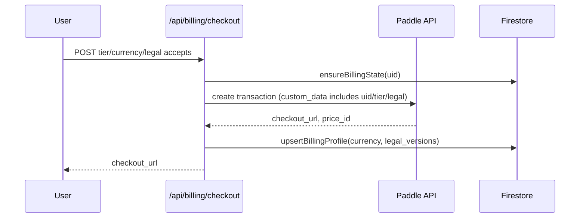
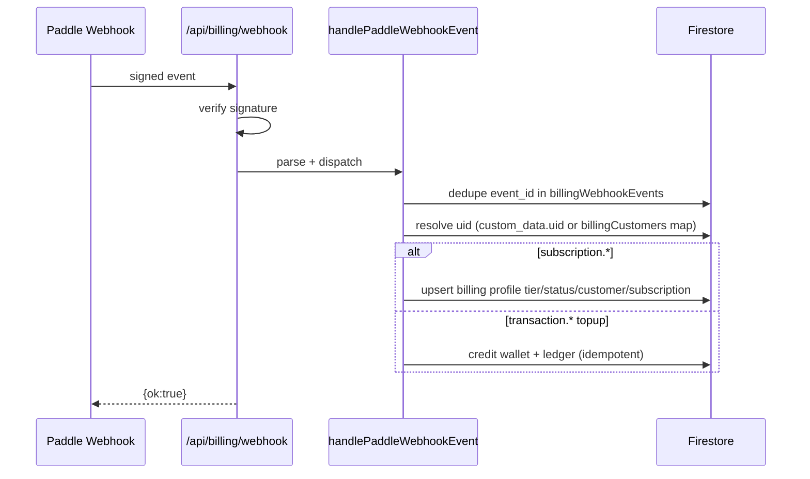
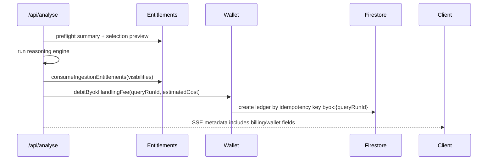

# Billing Lift-and-Shift Handoff (SOPHIA)

Snapshot date: 2026-03-14  
Source implementation: `/Users/adamboon/projects/sophia`

## Document 1: Migration Spec

### 1. Scope
Port the complete consumer billing domain:
- Subscription checkout (Pro/Premium)
- Wallet top-ups
- Paddle webhook processing
- Monthly ingestion entitlements
- BYOK handling-fee charging
- Learn-module wallet-to-scholar-credit conversion
- Founder-offer onboarding logic

Reference implementation root: `/Users/adamboon/projects/sophia/src/lib/server/billing`

### 2. Canonical Types
Implement exactly:
- `BillingTier`: `free | pro | premium`
- `BillingStatus`: `active | trialing | past_due | canceled | inactive`
- `CurrencyCode`: `GBP | USD`
- `IngestVisibilityScope`: `public_shared | private_user_only`
- `BillingLedgerEventType`: `byok_fee | topup | subscription | adjustment`

Reference: `/Users/adamboon/projects/sophia/src/lib/server/billing/types.ts`

### 3. Persistence Model (Firestore)
Collections/documents:
- `users/{uid}/billing/profile`
- `users/{uid}/billing/entitlements`
- `users/{uid}/billing/wallet`
- `users/{uid}/billingLedger/{idempotency_key}`
- `billingCustomers/{paddle_customer_id}`
- `billingWebhookEvents/{event_id}`
- `billingPrograms/{program_id}` (founder slot allocation)

Profile fields:
- `tier`, `status`, `currency`
- `paddle_customer_id`, `paddle_subscription_id`, `period_end_at`
- `founder_offer`
- `legal_terms_version`, `legal_privacy_version`
- `created_at`, `updated_at`

Entitlements fields:
- `month_key`
- `public_ingest_used`, `private_ingest_used`
- `byok_fee_charged_cents`
- `updated_at`

Wallet fields:
- `currency`
- `available_cents`
- `lifetime_purchased_cents`
- `lifetime_spent_cents`
- `updated_at`

Reference:
- `/Users/adamboon/projects/sophia/src/lib/server/billing/store.ts`
- `/Users/adamboon/projects/sophia/src/lib/server/billing/wallet.ts`
- `/Users/adamboon/projects/sophia/src/lib/server/billing/webhook.ts`

### 4. Rules Engine
Ingestion quotas:
- Free: public 2, private 0, public-after-private 0
- Pro: public 3, private 1, public-after-private 2
- Premium: public 5, private 1, public-after-private 3

BYOK handling fee:
- `fee_cents = round(estimated_run_cost_usd * 100 * 0.10)`

Month rollover:
- Reset monthly counters when `month_key != current UTC YYYY-MM`.

Effective tier:
- Founder active => `premium`
- Non-free tier requires active/trialing status, otherwise effective demotion to `free` (unless founder override applies)

Reference:
- `/Users/adamboon/projects/sophia/src/lib/server/billing/types.ts`
- `/Users/adamboon/projects/sophia/src/lib/server/billing/entitlements.ts`
- `/Users/adamboon/projects/sophia/src/lib/server/billing/founder.ts`

### 5. External Provider Contract (Paddle)
Required runtime env:
- `PADDLE_RUNTIME` (`sandbox|production`) recommended explicit
- `PADDLE_API_KEY`
- `PADDLE_WEBHOOK_SECRET`
- `PADDLE_PRICE_PRO_GBP`, `PADDLE_PRICE_PRO_USD`
- `PADDLE_PRICE_PREMIUM_GBP`, `PADDLE_PRICE_PREMIUM_USD`
- `PADDLE_PRICE_TOPUP_SMALL_GBP`, `PADDLE_PRICE_TOPUP_SMALL_USD`
- `PADDLE_PRICE_TOPUP_LARGE_GBP`, `PADDLE_PRICE_TOPUP_LARGE_USD`

Public pricing page env:
- `PUBLIC_PADDLE_CLIENT_TOKEN_SANDBOX` or `PUBLIC_PADDLE_CLIENT_TOKEN_PRODUCTION`
- Optional checkout presentation envs (`PUBLIC_PADDLE_CHECKOUT_*`)

Reference:
- `/Users/adamboon/projects/sophia/src/lib/server/billing/paddle.ts`
- `/Users/adamboon/projects/sophia/src/lib/server/billing/runtime.ts`
- `/Users/adamboon/projects/sophia/src/routes/pricing/+page.server.ts`

### 6. API Contracts To Recreate
- `POST /api/billing/checkout`
- `POST /api/billing/topups`
- `POST /api/billing/portal`
- `GET /api/billing/entitlements`
- `POST /api/billing/sync`
- `POST /api/billing/webhook`
- `POST /api/billing/founder/ack`
- `GET|POST /api/learn/entitlements` (wallet->scholar conversion path)

Auth:
- Bearer Firebase token required for all `/api/*` except webhook.

Reference: `/Users/adamboon/projects/sophia/src/hooks.server.ts`

### 7. Required `custom_data` Payload Keys
Subscription checkout transaction:
- `uid`
- `purchase_kind="subscription"`
- `tier`
- `currency`
- `legal_terms_version`
- `legal_privacy_version`

Top-up checkout transaction:
- `uid`
- `purchase_kind="topup"`
- `topup_pack`
- `topup_cents`
- `currency`

### 8. Sequence Specs






### 9. Idempotency Requirements
- Webhooks: dedupe by `event_id` in `billingWebhookEvents`.
- Wallet topup ledger key: `topup:{provider_event_id}`.
- BYOK charge ledger key: `byok:{query_run_id}`.
- Founder bonus ledger key: `founder:{program_id}`.
- Never mutate existing ledger events after creation.

### 10. Feature Flags
- `ENABLE_BILLING` (default true in current code)
- `ENABLE_INGEST_VISIBILITY_MODE` (default true)
- `ENABLE_BYOK_WALLET_CHARGING` (default false)
- `BYOK_WALLET_SHADOW_MODE` (default true)

Reference: `/Users/adamboon/projects/sophia/src/lib/server/billing/flags.ts`

### 11. Migration Acceptance Criteria
1. Same API responses and status codes for all billing routes.
2. Same entitlement outcomes for free/pro/premium matrix.
3. Webhook replay safety works (duplicate ignored).
4. BYOK fee charged once per `query_run_id`.
5. Wallet top-ups idempotent for repeated webhook delivery.
6. Learn conversion debits wallet and credits scholar balance atomically.
7. Founder offer allocation enforces global slot cap.

### 12. Known Gaps To Fix During Port
- Preserve `created_at` semantics on profile upsert.
- Add webhook timestamp freshness window.
- Keep unsigned webhook mode disabled outside local dev.
- Add billing routes to OpenAPI in target system.
- Add billing env vars to target `.env.example`.

---

## Document 2: Copy-Paste Implementation Prompt For Another AI

Use the text below as-is in another AI chat.

```md
Implement a full billing/payment domain by reproducing the architecture and behavior from SOPHIA (SvelteKit + Firestore + Paddle). Follow this exact order and do not skip tests.

Objective:
- Build subscription checkout (pro/premium), wallet topups, webhook ingestion, monthly entitlements, BYOK handling-fee charging, and learn-credit conversion.
- Keep idempotency, ledger integrity, and transactional updates equivalent to source behavior.

Tech assumptions:
- Server framework with route handlers (SvelteKit-like or equivalent).
- Firestore (or equivalent transactional document DB).
- Paddle Billing API.
- Existing authenticated user context with uid/email.

Step 1: Define canonical types
- BillingTier: free|pro|premium
- BillingStatus: active|trialing|past_due|canceled|inactive
- CurrencyCode: GBP|USD
- IngestVisibilityScope: public_shared|private_user_only
- BillingLedgerEventType: byok_fee|topup|subscription|adjustment
- Founder offer profile shape
- Entitlement summary and consume result shapes

Step 2: Implement data access layer (transactional)
- users/{uid}/billing/profile
- users/{uid}/billing/entitlements
- users/{uid}/billing/wallet
- users/{uid}/billingLedger/{idempotency_key}
- billingCustomers/{paddle_customer_id}
- billingWebhookEvents/{event_id}
- billingPrograms/{program_id}

Functions required:
- ensureBillingState(uid)
- upsertBillingProfile(uid, patch)
- acknowledgeFounderOfferNotice(uid)
- default profile/entitlements/wallet creators
- normalization helpers

Important fix:
- Do not overwrite created_at on every upsert; set it only on first write.

Step 3: Implement billing rules engine
- TIER_INGESTION_RULES:
  - free: public 2, private 0, publicWhenPrivate 0
  - pro: public 3, private 1, publicWhenPrivate 2
  - premium: public 5, private 1, publicWhenPrivate 3
- currentMonthKeyUtc() and rollover resets
- deriveEffectiveTier() with founder override
- consumeIngestionEntitlements(uid, visibilities[])
- applyByokFeeUsage(uid, amountCents)

Step 4: Implement wallet + ledger logic
- computeByokFeeCents(estimatedRunCostUsd) = round(usd * 100 * 0.10)
- assertByokWalletBalance(uid, minimumCents)
- debitByokHandlingFee({uid, queryRunId, estimatedRunCostUsd, currency})
  - idempotency key: byok:{queryRunId}
  - fail gracefully on insufficient funds
- creditWalletTopup({uid, amountCents, currency, idempotencyKey, provider, providerEventId, note})
  - idempotency key: topup:{idempotencyKey}
- never mutate existing ledger events after creation

Step 5: Implement Paddle integration
- Runtime selection function: sandbox|production with explicit env override
- Auth headers with API key compatibility checks by runtime
- createSubscriptionCheckout()
- createTopupCheckout()
- createCustomerPortalSession()
- listRecentTransactions() for sync endpoint fallback
- verifyPaddleWebhookSignature(rawBody, header)
- parsePaddleWebhook(rawBody)
- mapWebhookCurrency(data)

Security hardening required:
- Enforce webhook timestamp freshness window when verifying signature.
- Keep unsigned-webhook bypass disabled in non-local environments.

Step 6: Implement webhook service
- handlePaddleWebhookEvent(event):
  - Deduplicate by event_id in billingWebhookEvents
  - Resolve uid from custom_data.uid or billingCustomers map
  - For subscription.*: upsert profile tier/status/customer/subscription/period_end
  - For transaction.completed|transaction.paid:
    - purchase_kind=topup => credit wallet
    - purchase_kind=subscription => mark active subscription profile
  - Ignore unknown events safely

Step 7: Implement API routes
- POST /api/billing/checkout
- POST /api/billing/topups
- POST /api/billing/portal
- GET /api/billing/entitlements
- POST /api/billing/sync
- POST /api/billing/webhook
- POST /api/billing/founder/ack
- GET|POST /api/learn/entitlements (convert wallet to scholar credits)

Auth contract:
- Require Bearer auth for all /api routes except webhook.

Checkout contract:
- Require legal acceptance flags.
- Include legal versions in checkout payload and profile.

Step 8: Integrate with analyse flow
- Preflight:
  - load entitlement summary + wallet snapshot
  - deny if ingestion selection exceeds quotas
  - deny if BYOK charging enabled and wallet insufficient
- On successful run:
  - consume ingestion entitlements for selected links
  - estimate BYOK fee from model cost breakdown
  - debit fee with byok:{queryRunId} idempotency
  - include billing/wallet details in response metadata

Step 9: Learn module integration
- Tier-based quotas for micro_lesson, short_review, essay_review
- Convert wallet cents to scholar credits transactionally
- If essay quota exhausted but scholar credits available, consume scholar credit

Step 10: Config + docs
- Add env vars to .env.example:
  - ENABLE_BILLING
  - ENABLE_INGEST_VISIBILITY_MODE
  - ENABLE_BYOK_WALLET_CHARGING
  - BYOK_WALLET_SHADOW_MODE
  - all required PADDLE_* and PUBLIC_PADDLE_* vars
- Add billing endpoints to OpenAPI docs
- Provide a Paddle bootstrap/setup script for products/prices/webhook

Step 11: Tests (mandatory)
Create these test suites:

1) Entitlement matrix tests
- free/pro/premium public/private combinations
- combo limit behavior after private ingestion
- month rollover reset behavior

2) Wallet + ledger tests
- byok fee charge success
- byok duplicate queryRunId => no double charge
- insufficient balance path
- topup duplicate idempotency key => no double credit

3) Webhook tests
- valid signature accepted
- invalid signature rejected
- stale timestamp rejected
- duplicate event_id ignored
- subscription and topup events mapped correctly

4) Route tests
- auth required on protected routes
- checkout/topup legal acceptance required
- billing disabled flag behavior
- sync route reconciliation behavior

5) Analyse billing integration tests
- quota preflight rejection
- successful entitlement consume post-run
- byok fee charge statuses (charged/skipped/insufficient/shadow)

6) Learn conversion tests
- convert wallet to scholar credits success/failure
- essay review consuming scholar credit when monthly cap reached

Definition of done:
- All tests pass.
- Ledger writes are idempotent and append-only.
- OpenAPI and env docs include billing.
- No created_at overwrite bug.
- Webhook verification includes timestamp freshness and no unsafe bypass in production.
```

