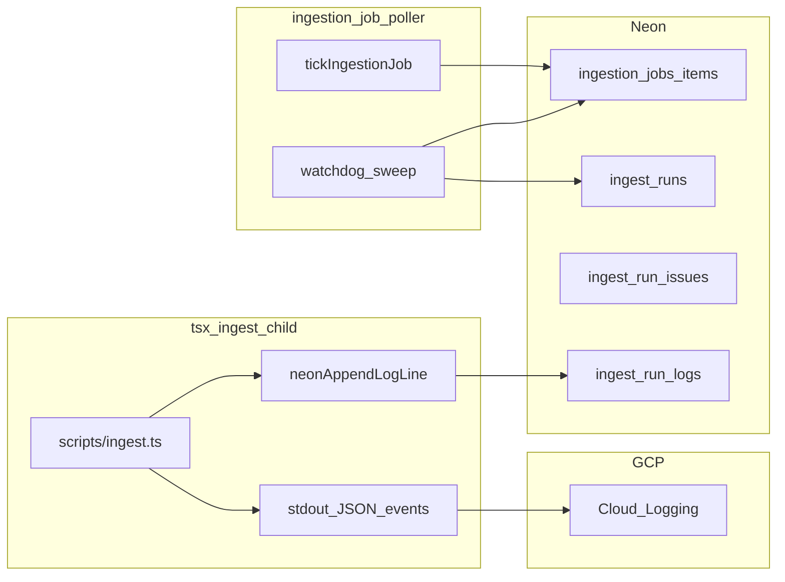

---

## status: draft
owner: engineering
last_reviewed: 2026-04-11

# Ingest idle watchdog and observability

**Source:** Plan agreed in Cursor (2026-04-11). Canonical copy lives in-repo at this path for sharing and iteration.

## Overview

Evaluate PostHog / Sentry / GCP / OpenTelemetry for long-running ingest observability, then implement a Neon + poller-driven **idle watchdog** (admin-spawned runs and ingestion jobs) and **structured stage + heartbeat logging** — with optional PostHog aggregates — without replacing Neon as the operational source of truth.

## Off-the-shelf assessment (what fits without bespoke replacing everything)

| Capability                                                         | PostHog (already: `posthog-node`, `src/lib/server/analytics.ts`)                              | Sentry (not in repo today)                                                           | GCP Cloud Logging (already: `@google-cloud/logging`; Cloud Run captures stdout/stderr) | OpenTelemetry                                                                 |
| ------------------------------------------------------------------ | --------------------------------------------------------------------------------------------- | ------------------------------------------------------------------------------------ | -------------------------------------------------------------------------------------- | ----------------------------------------------------------------------------- |
| Long-running **CLI** (`tsx scripts/ingest.ts`) spans, stage timing | Possible via `capture` from child; must handle **flush on exit**, offline, and **PII** (URLs) | **Good fit:** transactions/spans, error grouping, profiles; Node SDK in ingest child | **Good fit** if logs are **structured JSON** (no extra vendor for “what happened”)     | Best **vendor-neutral** spans; more setup (exporter to GCP or OTLP collector) |
| **Stall / hang** detection (no return from `generateText`)         | Weak alone (no heartbeat unless you emit events)                                              | **Profiling + stuck transaction** helps post-mortem; still need **parent heartbeat** | Heartbeat as **log lines** with `run_id` works                                         | Same as logging + spans                                                       |
| **Operator UI** correlation (`run_id`, `job_id`)                   | Properties on events; not a replay log                                                        | Trace IDs + breadcrumbs                                                              | **Log-based queries** in Cloud Console                                                 | Trace UI if exported                                                          |
| **Durable query / dashboards** you own                             | PostHog retention/pricing; not your DB                                                        | Sentry retention                                                                     | Logs retention + log-based metrics                                                     | Depends on backend                                                            |
| **Action layer** (requeue after idle)                              | Not an action system                                                                          | Not an action system                                                                 | Not an action system                                                                   | Not an action system                                                          |

**Conclusion:** Neither PostHog nor Sentry replaces a **first-party watchdog** that reads `**ingest_runs.last_output_at`** (see `src/lib/server/db/schema.ts`) and drives **job item + run state transitions**. They **augment** detection and forensics.

### Recommended hybrid (pragmatic)

1. **Source of truth for “what happened on run X”:** extend existing `**ingest_run_logs`** + `**ingest_run_issues**` + `ingest_runs` columns (`current_stage_key`, `last_output_at`, etc.). Optionally add `**ingest_run_events**` (narrow jsonb rows: `type`, `ts`, `payload`) if you want queryable spans without parsing log lines.
2. **Operator + SRE visibility:** **structured JSON logs** to stdout from `scripts/ingest.ts` (and parent `ingestRunManager` when spawning), with stable fields: `run_id`, `job_id`, `item_id`, `stage`, `event`, `duration_ms`, `provider`, `model`, `error_class`. Cloud Run ingests these automatically.
3. **Product / trend analytics:** optional `**logServerAnalytics`**-style calls to existing PostHog (`src/lib/server/analytics.ts`) for **aggregates** only (e.g. `ingest_stage_completed`, `ingest_watchdog_fired`) with **hashed** `source_url` or no URL.
4. **Sentry:** optional follow-up if you want error grouping/stack traces for the **child process** without building a fingerprint pipeline; orthogonal to the watchdog.

### Data flow (high level)

## Watchdog (5-minute idle, admin + jobs)

**Problem today:** Stale detection in `src/lib/server/ingestionJobs.ts` (`isStuckIngestRun`, `INGEST_JOB_ITEM_STALE_MS` / `INGEST_JOB_ITEM_MAX_WALL_MS`) runs when a **job is ticked** and loads child state from Neon / memory. If **both** workers are wedged and **nothing ticks**, or an **admin-only run** has no job, nothing heals.

**Design:**

1. **Define idle:** `now - coalesce(last_output_at, created_at) > INGEST_WATCHDOG_IDLE_MS` (default **300000**) for rows where `ingest_runs.status` is in-flight (`running` / `queued` as applicable).
2. **Where it runs:** Add `**sweepStalledIngestRuns()`** (Neon query + updates) called from:
  - `scripts/ingestion-job-poller.ts` each interval, **and/or**
  - `tickAllRunningIngestionJobs` / `tickIngestionJob` so admin-heavy paths still sweep.
3. **Actions (configurable, avoid duplicate work):**
  - **Phase A (safe):** append `ingest_run_issues` row + log line + set `ingest_runs.error` / status to `error` with reason `watchdog_idle_timeout`, bump `updated_at`.
  - **Phase B (requeue):** if run is linked to `ingestion_job_items.child_run_id`, transition item to `**error` or `pending`** with structured `last_error` (operator **Queue again** / auto-requeue). Prefer **one** automatic path to avoid double Surreal writes; e.g. `pending` + clear `child_run_id` only when safe or behind env `INGEST_WATCHDOG_REQUEUE=1`.
  - **Phase C (SIGTERM child):** only for runs where parent is **this** host’s `ingestRunManager`. For **detached** children, document limitation; rely on Neon **error** so UI unblocks.
4. **Concurrency “both frozen”:** Watchdog should **not** spawn a second run for the same canonical source without a **lease**; align with `ingestGlobalConcurrencyGate`. Marking runs **error** can free slots (explicit policy).

## Logging and observability “full suite”

**In `scripts/ingest.ts` (and narrow helpers):**

- Emit **one JSON object per line** (prefix e.g. `[INGEST_TELEMETRY]`) for: `stage_start`, `stage_end`, `model_call_start`, `model_call_end` (duration_ms, provider, model, token counts when available), `batch_split`, `retry`, `watchdog_signal`.
- **Heartbeat timer** during `callStageModel` / long loops: every N seconds log `heartbeat` with `stage`, `batch_index` — addresses hangs where the SDK never returns.
- **Error fingerprint:** normalized string (strip ids) in `ingest_run_issues` or telemetry payload for clustering.

**In `src/lib/server/ingestRuns.ts`:** ensure `neonBumpRunActivity` / log flush paths align with heartbeat (may require callback or flush from child).

**Neon (optional):** new table `ingest_run_telemetry` (`run_id`, `ts`, `event`, `payload jsonb`) with index on `(run_id, ts)` — keeps `ingest_run_logs` human-readable while enabling SQL dashboards. Alternative: parse `[INGEST_TELEMETRY]` lines into issues / nightly rollup.

**PostHog:** thin wrapper on `logServerAnalytics` for low-cardinality events; async, best-effort, never block ingest on PostHog.

## Testing and rollout

- Unit tests: idle threshold math, idempotency (watchdog twice on same run).
- Integration: mock Neon rows + poller sweep where `DATABASE_URL` is available in CI.
- Rollout: default idle threshold is **5 minutes** when `INGEST_WATCHDOG_IDLE_MS` is unset; set to **`0`** to disable (e.g. local). Staging/prod: rely on defaults or override explicitly; use Cloud Logging + Neon monitoring.

## Implementation todos

| ID                | Task                                                                                                                                      |
| ----------------- | ----------------------------------------------------------------------------------------------------------------------------------------- |
| vendor-doc        | Document hybrid observability (Neon + JSON logs + optional PostHog/Sentry) in ops doc or link from `docs/operations/gcp-ingest-worker.md` |
| telemetry-ingest  | Structured JSON + heartbeat + stage boundaries in `scripts/ingest.ts`; flush activity to Neon where needed                                |
| neon-events       | Optional: Drizzle migration `ingest_run_telemetry` + repository helpers; or parse telemetry lines into `ingest_run_issues`                |
| watchdog-sweep    | `sweepStalledIngestRuns` in ingestion/ingestRun repository; call from `ingestion-job-poller` and/or `tickAllRunningIngestionJobs`         |
| watchdog-actions  | Issue + log + terminal error; optional requeue job item; env flags; concurrency gate interaction                                          |
| posthog-aggregate | Optional: `logServerAnalytics` for watchdog + stage complete (no raw URLs)                                                                |
| tests             | Vitest for watchdog idempotency and telemetry parsing; Cloud Run log query example                                                        |

## Related code

- `src/lib/server/ingestionJobs.ts` — job tick, `isStuckIngestRun`, env `INGEST_JOB_ITEM_STALE_MS`
- `src/lib/server/ingestRuns.ts` — `lastOutputAt`, `neonBumpRunActivity`
- `src/lib/server/db/ingestRunRepository.ts` — Neon persistence for runs/logs/issues
- `scripts/ingestion-job-poller.ts` — periodic tick entrypoint
- `src/lib/server/analytics.ts` — PostHog server events

