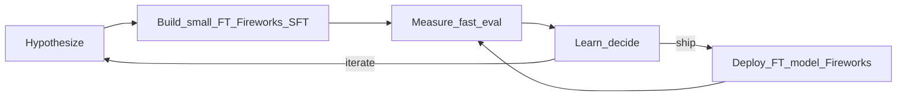

# Lean iterative extraction fine-tuning — **plan** (canonical, repo-tracked)

**Not legal advice.** G0/G1: [../local/operations/ingestion-fine-tune-data-mitigation-plan.md](../local/operations/ingestion-fine-tune-data-mitigation-plan.md).

This document is the **revised** lean loop plan (hypothesis → build → measure → learn). It supersedes informal notes: **primary training vendor = Fireworks supervised fine-tuning (SFT)** so you avoid Together → adapter download → local merge → upload for each iteration. **Together** remains documented as a **legacy** path in [../local/operations/together-lora-phase2-runbook.md](../local/operations/together-lora-phase2-runbook.md).

**Companion docs:** [extraction-ft-lean-baseline.md](./extraction-ft-lean-baseline.md) (frozen eval commands), [extraction-ft-lean-iteration-log.md](./extraction-ft-lean-iteration-log.md) (append-only rows), [extraction-ft-lean-pause-points.md](./extraction-ft-lean-pause-points.md) (human vs agent), [extraction-fireworks-deploy.md](./extraction-fireworks-deploy.md) (deploy + **SFT addendum**).

---

## Principles

- **One primary hypothesis per iteration** — falsify or support a single claim on `schemaPassRate` / `subsetTextMatchRate` (see baseline doc).
- **Smallest build** — data deltas and hyperparam nudges; cap rows and job cost per sprint.
- **Measure before merge** — same two-slice eval (`pnpm ops:eval-extraction-compare`, `--limit 200`).
- **Learn in writing** — iteration log subsection per cycle.

### Production extraction model — **Vertex (plan change)**

The original lean loop assumed you might serve **fine-tuned extraction** from the same vendor you train on (e.g. Fireworks) or alternate APIs for A/B. **Production ingestion extraction is now pinned to Vertex (Gemini)** as the default route: it is the **only** stack we can run **reliably at scale** while still **reusing model outputs for future training** (data-handling, ToS, and operational path align with GCP workload identity and our ingest pipeline). **Fireworks SFT + dedicated deployments** remain the **primary build path for iterative fine-tuning and offline eval** (`pnpm ops:eval-extraction-*`); that is **not** the same as the production `vertex:…` extraction slug unless you explicitly wire it. See [extraction-ft-lean-baseline.md](./extraction-ft-lean-baseline.md) for env split.

**When Fireworks capacity is unreliable:** Prefer a **primary + fallback** story (FT when up, Vertex for completion) and/or move serving toward **GCP** — options and trade-offs are spelled out in [extraction-fireworks-deploy.md](./extraction-fireworks-deploy.md) § *Availability, capacity, and alternative hosting*.

---

## Contract lock (unchanged)

Training **messages** must match production: same folded system + user shape as ingest (`EXTRACTION_SYSTEM` / `EXTRACTION_USER`, `scripts/convert-phase1-jsonl-to-together-chat.ts` defaults), same JSON-array semantics (`parseExtractionJsonFromModelResponse`). Any prompt change invalidates cross-run comparison until you bump **dataset / manifest fingerprints** in the eval report notes.

---

## Primary build path — Fireworks SFT

| Step | Owner | Action |
|------|--------|--------|
| **A** | Agent / you | After JSONL changes: `pnpm ops:phase2-step-a-together-packaging -- --export-dir data/phase1-training-export` (still named “together” — output is **generic chat JSONL**). |
| **B** | You | Confirm starting weights (see **Sophia default SFT weights** below) and run `firectl model get …` → **`Tunable: true`** where required. |
| **C** | You + agent | `pnpm ops:fireworks-submit-sft -- --dry-run …` then live submit with **`FIREWORKS_API_KEY`** and account id (`FIREWORKS_ACCOUNT_ID` or infer from `EXTRACTION_MODEL`). Optional: `--write-report data/phase1-training-export/fireworks-sft-job-submitted.json`. |
| **D** | You | Wait for job completion in Fireworks UI or `firectl sftj get …`; then **`firectl deployment create`** using the **output model id** (short slug you passed to `--output-model`, or the full `accounts/.../models/...` from the job — match `firectl deployment create --help` / vendor docs). See [extraction-fireworks-deploy.md](./extraction-fireworks-deploy.md). |
| **E** | Agent / you | Set `EXTRACTION_MODEL` to the new **deployment** id; run `pnpm ops:eval-extraction-compare`. |

### Sophia default SFT weights (this deployment)

The merged extraction model already on Fireworks (uploaded via `firectl model create sophia-extract-m7b-ft …`) is:

**`accounts/adam-boon1984-17nryg/models/sophia-extract-m7b-ft`**

**Verified (2026-04-16):** `firectl model get sophia-extract-m7b-ft` reported **`Tunable: true`**, **`Supports Lora: true`**, **`State: READY`**, **`Kind: HF_BASE_MODEL`** — use this full id as **`--base-model`** for the first (and any base-model) Fireworks SFT from your merged upload. Re-check with `firectl model get` if Fireworks ever rejects a job or the model is recreated.

1. **Before a new SFT on a new or changed upload**, run:  
   `firectl model get sophia-extract-m7b-ft`  
   Confirm **`Tunable: true`**, then use that full string as **`--base-model`** so the LoRA trains **from your current weights**.
2. If **`Tunable: false`** but **`Supports Lora: true`**, that usually means inference-only LoRA attach — pick a Fireworks **catalog** model that is **`Tunable: true`** for `--base-model`, or ask Fireworks support whether your account can enable SFT from that custom upload.
3. **Second and later iterations** on Fireworks (continuing from a **prior Fireworks SFT job output**): use **`--warm-start-from accounts/<account>/models/<PRIOR_OUTPUT_MODEL>`** (mutually exclusive with `--base-model` in the API). The script supports both flags.

**Deployments vs models:** inference uses `accounts/.../deployments/...`; SFT reads **`accounts/.../models/...`**. Each successful SFT produces a **new** model id — create a **new** deployment for eval, then retire or keep the old deployment for rollback.

**Legacy path:** Together LoRA + merged tarball + `firectl model create` — [together-lora-phase2-runbook.md](../local/operations/together-lora-phase2-runbook.md).

---

## Metric stack (unchanged)

Canonical script: `scripts/eval-extraction-holdout-openai-compatible.ts`. Gates: **`schemaPassRate`**, **`subsetTextMatchRate`** (golden), remit slice for breadth; **`--mismatch-diagnostics`**; latency p50/p95. Wrapper: `pnpm ops:eval-extraction-compare`.

---

## Cycles 1–3 (hypotheses)

Same scientific content as before; only **Step B/C** swap from Together to Fireworks:

1. **Format / batch-shaped JSON** — batch supervision; measure schema on golden + text match on remit.
2. **`passage_id` grounding** — small hand eval JSONL + optional ingest smoke.
3. **Prod failure exemplars** — G1-cleared; offline eval before ingest smoke.

Detail checklists: [extraction-ft-lean-iteration-log.md](./extraction-ft-lean-iteration-log.md).

---

## Agent vs human — todo checklist

Use this as Cursor / operator todos (copy into a session or issue).

### Setup (once per export vintage)

- [ ] Confirm `manifest.json` fingerprints documented in [extraction-ft-lean-baseline.md](./extraction-ft-lean-baseline.md).
- [ ] Confirm Fireworks account + API key; infer or set `FIREWORKS_ACCOUNT_ID`.

### Every iteration

- [ ] **Human:** Write one-paragraph hypothesis (which metric, which slice).
- [ ] **Human:** G1 approval for any training row change.
- [ ] **Agent:** `pnpm ops:phase2-step-a-together-packaging` after export edits.
- [ ] **Human:** Choose `--base-model` (Tunable) and `--output-model` slug.
- [ ] **Agent:** `pnpm ops:fireworks-submit-sft -- --dry-run` with correct files; **Human:** approve spend → remove `--dry-run`.
- [ ] **Human:** Create deployment when job completes; paste deployment id / model id into iteration log.
- [ ] **Human:** Wake or wait for scale-from-zero if needed.
- [ ] **Agent:** `pnpm ops:eval-extraction-compare -- --limit 200 --out …/eval-compare-<iter>.json`.
- [ ] **Human:** Decision (ship / iterate / stop) + next hypothesis in iteration log.

### Optional engineering (separate PRs)

- [ ] Telemetry: `extraction_inner_array_recoveries` (or similar) for format salvage vs parse.
- [ ] Extend `fireworks-submit-sft.ts` with region, W&B, or other SFT job fields as needed.

---

## Artefacts

- Versioned **`eval-compare-*.json`** under `data/phase1-training-export/` (commit if policy allows).
- **`fireworks-sft-job-submitted.json`** (from `--write-report`) for job id + dataset ids.
- Together lineage (legacy): `artifact-ft-*.json`, Together job JSON — [phase2-step-d-artifacts-runbook.md](../local/operations/phase2-step-d-artifacts-runbook.md).
