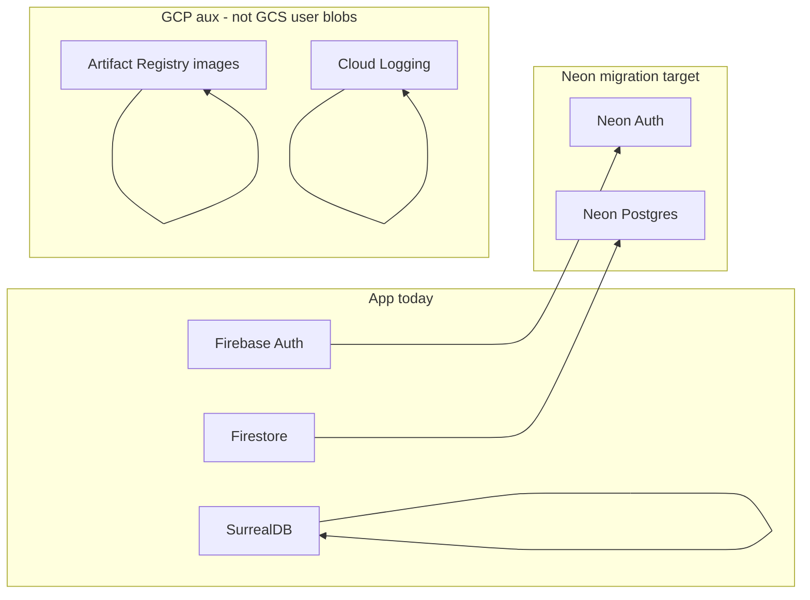
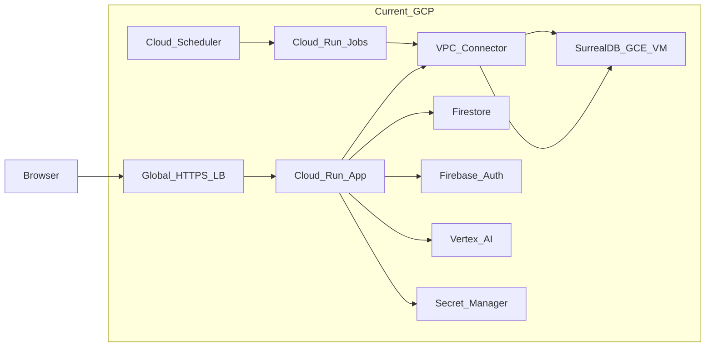

# Unified GCP exit and Neon migration review

**IDE copy:** This file lives in the repo so it appears in the project tree. Cursor’s **Plans** panel uses files under `~/.cursor/plans/` (outside the workspace); keep this document in sync when you edit the plan there, or edit here and copy back if you use Cursor Plans.

**Sources:** Wider infrastructure appraisal from repository analysis; **Neon DB report** from [`neon-migration-gcp-storage-scope.md`](neon-migration-gcp-storage-scope.md) (also Cursor plan `gcp_storage_vs_neon_plan_af2cbfc8`).

**Reading order:** Part A = what Neon does *not* need to solve (storage) + target diagram; Part B = full GCP inventory and cost/hosting exit; Part C = application-level Firestore/Auth→Neon work still required.

## Migration checklist (from Cursor plan)

- [ ] **Billing forensics** — Export GCP Billing (by SKU/service) for one month; rank top cost drivers vs connector / VM / LB / Run
- [ ] **SurrealDB posture** — Decide: relocate VM, Surreal Cloud, public+auth hardening, or graph DB migration
- [x] **Neon GCP storage scope** — See Part A; detail in [`neon-migration-gcp-storage-scope.md`](neon-migration-gcp-storage-scope.md)
- [ ] **Neon schema + auth cutover** — Full Firestore→Neon Postgres schema, RLS, Neon Auth token contract; map `src/lib/server` Firestore/BYOK/KMS touchpoints
- [ ] **Hosting shortlist** — After DB+jobs topology is clear, shortlist Vercel vs Fly/Railway vs Cloudflare vs VPS; spike adapter + connectivity
- [ ] **Vertex deprecation** — Inventory Vertex-only code paths; plan API-key or alternate providers to drop `aiplatform.user` and GCP project coupling

---

## Part A — Neon migration: GCP storage scope (full report)

*Below is the substantive content of the Neon storage-scope report, integrated into the wider review.*

### A.1 Application runtime: no GCS / Firebase Storage

- **Firebase Storage** is not imported or used anywhere (no `firebase/storage`, no `getStorage`).
- **Direct GCS usage** in TypeScript/JavaScript: none. The only `@google-cloud/*` dependency declared in [`package.json`](../../package.json) is **`@google-cloud/logging`**, used by [`src/lib/server/cloud-logger.ts`](../../src/lib/server/cloud-logger.ts) for **Cloud Logging**, not object storage.
- **`@google-cloud/storage`** appears in the lockfile as a **transitive** dependency (not a first-class app dependency); there are **no** `import` sites in `src/` or `scripts/`.

**Conclusion:** The **Neon + Neon Auth** migration does **not** need to replace an existing “files in GCS” or “Firebase Storage” layer in this repo.

### A.2 Operational / docs: GCS for Firestore backups only

- Archived docs (e.g. [`docs/archive/delivery/migration-quickstart.md`](../archive/delivery/migration-quickstart.md), [`docs/archive/delivery/gcp-org-migration.md`](../archive/delivery/gcp-org-migration.md)) describe **`gsutil` + `gcloud firestore export`** to a bucket such as `gs://sophia-firestore-backups` — **backup/migration procedure**, not application reads/writes.
- **Include in the Neon plan only if** you want a **documented cutover** for backups: e.g. after moving off Firestore, use **Neon’s backup/PITR** (or your own `pg_dump` to an object store of choice). That is **optional** and separate from app code; you could keep or retire the GCS bucket used only for Firestore exports.

### A.3 GCP infra: what is “storage-like” but not user data

From [`infra/index.ts`](../../infra/index.ts) (and `bin/index.js`):

| Resource | Role |
| -------- | ---- |
| **Artifact Registry** (`gcp.artifactregistry.Repository`) | Stores **Docker images** for Cloud Run (app + ingest). Stays relevant as long as you deploy on GCP; **not** replaced by Neon. |
| **Firestore** (`roles/datastore.user` on the app SA) | Legacy Google Firestore IAM; app data now targets Neon `sophia_documents` via `sophiaDocumentsDb`. **Not** GCS. |
| **Cloud Logging** (`roles/logging.logWriter`) | Logs, not blobs. |

No Pulumi-managed **Cloud Storage bucket** for app data appears in the infra files reviewed.

### A.4 Recommendations from the Neon storage report

- **Do not** fold “migrate GCS app storage” into the Neon workstream — there is no such layer in code today.
- **Optionally** add a **short backup/DR subsection** in ops docs: retire Firestore-export-to-GCS playbooks once Firestore is gone; rely on Neon (and, if desired, external dump targets).
- **Keep separate** any future decision about **binary/file uploads** (if product needs them): that would be new design (e.g. S3-compatible, or GCS), not a migration of existing usage.

### A.5 Target architecture (from Neon report)

### A.6 Follow-ups (optional, from Neon report)

- Treat GCS/Firebase Storage as out of scope for Neon migration unless new file-upload product requirements appear.
- Optional: update ops docs to replace Firestore-export-to-GCS with Neon backup / `pg_dump` strategy after cutover.

---

## Part B — Wider GCP exit: inventory, costs, hosting

### B.1 Grounding in the repo

This section is grounded in [`infra/index.ts`](../../infra/index.ts), [`svelte.config.js`](../../svelte.config.js), [`.github/workflows/deploy.yml`](../../.github/workflows/deploy.yml), [`docs/sophia/architecture.md`](architecture.md), [`CONTRIBUTING.md`](../../CONTRIBUTING.md).

### B.2 What you are running on GCP today (from code)

| Area | What the repo shows | Notes for exit |
| --------------------- | -------------------------------------------------------------------------------------------------------------------- | ---------------------------------------------------------------------------------------------------------------------------------------------------------------------------------------------------------------------------------------------------------------------------------------------------------------------- |
| **Compute / routing** | Cloud Run v2 app (`infra/index.ts` `sophia-app`), min/max instances, memory/CPU from Pulumi config | Core web app; today uses `@sveltejs/adapter-node` (`svelte.config.js`). |
| **Jobs** | Cloud Run Jobs: ingestion + nightly link ingest; Cloud Scheduler triggers nightly job | Long timeouts, VPC, **not** a good fit for vanilla serverless HTTP without redesign. |
| **Networking** | Serverless VPC connector (`minInstances: 2`, `maxInstances: 10`), firewall to DB | Common **cost driver**; required for private SurrealDB reachability from Cloud Run. |
| **Data plane** | SurrealDB at **private** `SURREAL_URL` → `http://10.154.0.2:8000/rpc` (from Pulumi env) | Documented as GCE VM in runbooks (`docs/archive/delivery/gcp-org-migration.md`); VM not fully defined in the scanned `infra/index.ts` slice—likely manual or another stack. **Any “just use Vercel” plan must solve DB connectivity.** |
| **Firebase** | Legacy Auth + Firestore (`roles/datastore.user` on app SA); Neon Auth + `sophiaDocumentsDb` replace these in current direction | Matches `docs/sophia/architecture.md`: history, BYOK, billing, entitlements. |
| **Vertex AI** | `GOOGLE_VERTEX_PROJECT`, `roles/aiplatform.user` on app + ingest SAs | Used for embeddings / Gemini-style routes (`src/lib/server/vertex.ts`). **Can move off GCP billing** with **Google AI Studio API keys** (`GOOGLE_AI_API_KEY`) or non-Google providers—**without** hosting on GCP, if code paths support it. |
| **Secrets** | Secret Manager secrets wired in Cloud Run | Replace with Vercel env, Doppler, 1Password, etc. |
| **Edge / TLS** | Global HTTPS LB, managed certs, static IP for `usesophia.app` / `www` | Replace with host-provided TLS (Vercel, Cloudflare, etc.) or smaller LB elsewhere. |
| **Registry** | Artifact Registry for Docker images | Not Neon; not GCS. Not needed if you stop shipping images to GCP. |
| **CI** | WIF to GCP, build/push image, deploy Cloud Run (`deploy.yml`) | Would change to host-native deploy or container deploy elsewhere. |

### B.3 Interpreting “£85 in credits” and what you might save

- **Credits mask real burn**: After May, you pay **whatever the SKU-level bill is** minus any remaining credits. The **£85** figure is an order-of-magnitude for “this stack is not free.”
- **Likely largest GCP line items** (typical; confirm in **Billing → Reports → Group by SKU/service**):
  - **Always-on or min-scaled Cloud Run** + **VPC connector**
  - **GCE VM** for SurrealDB (24/7 disk + vCPU + egress)
  - **Global external HTTPS load balancer** + static IP
  - **Artifact Registry** storage/egress
  - **Vertex / Firestore** often smaller than compute/network unless traffic is high
  - **GCS** is not an app cost driver (**Part A**); any bucket for Firestore exports is **ops backup** only

**Action:** Export one month of **detailed cost table** (CSV) grouped by service/SKU and attach to your internal migration doc.

### B.4 Would Vercel be enough—and would you need Pro (~£20)?

**Fit for the SvelteKit app**

- Vercel expects **`@sveltejs/adapter-vercel`**, not **`adapter-node`** (`svelte.config.js`). Migration is standard but **is a real change**.
- **Free (Hobby) tier**: Often sufficient for **low traffic**; limits on bandwidth and invocations; no guaranteed SLA.
- **Pro** is **not** strictly required for “it runs”; heavy admin/API spikes may push you over free limits.

**Blockers — Vercel alone is not a full GCP replacement**

1. **SurrealDB on a private GCP IP** — Vercel cannot join your GCP VPC. Options: public TLS + hard auth, co-locate app+DB with private networking, or relocate graph store.
2. **Long-running ingestion jobs** — Need **GitHub Actions**, **Fly Machines**, **Railway/Render workers**, **Inngest/Trigger.dev**, or a **small VM** cron.

**Bottom line:** Vercel can replace **Cloud Run + HTTPS LB** for the **web tier** if SurrealDB and jobs are solved elsewhere. **Free tier may suffice** for modest traffic.

### B.5 Other options (OSS or generous free tiers)

| Option | Generous free / OSS angle | Fit for this repo |
| ------------------------------ | ---------------------------------------------------- | ----------------------------------------------------------------------------------------------------------------------------- |
| **Cloudflare Workers + Pages** | Strong free tier | SvelteKit supported; still need **SurrealDB connectivity** and **background jobs** off-platform. |
| **Netlify** | Solid free tier | Same caveats as Vercel for DB VPC and long jobs. |
| **Fly.io** | App + **Machines** for long jobs; private networking | Good **single-provider** story for app + worker + optional DB VM. |
| **Railway / Render** | Containers + cron | Easier **always-on** or **scheduled** workloads; verify current free tiers. |
| **Hetzner / VPS + Caddy** | OSS stack; cheap VMs | You operate **everything**—lowest cash cost, highest ops burden. |
| **Supabase** | OSS + generous free tier | **Postgres + Auth** overlaps **Neon + Neon Auth**—usually pick **one**. |

### B.6 SWOT summaries (concise)

**A) Stay on GCP but optimize (partial)** — Strengths: no migration. Weaknesses: connector/VM/LB costs. Threats: credit cliff in May.

**B) Vercel / Netlify / Cloudflare for web + external DB/jobs** — Strengths: DX, TLS/CDN. Weaknesses: no VPC to current SurrealDB; no native long jobs.

**C) Fly.io / Railway / Render** — Strengths: containers, cron, private networking patterns. Weaknesses: less zero-ops than Vercel.

**D) Self-hosted VPS + Docker Compose** — Strengths: lowest monthly cash, full control. Weaknesses: you run security/backups/TLS.

### B.7 Recommended sequence (infrastructure)

1. **Billing forensics** — Top 5 SKUs driving £85.
2. **SurrealDB posture** — Relocate VM, Surreal Cloud, public+auth, or graph migration.
3. **Parallel: Neon + auth** — See **Part C**; ops backup story in **Part A.2**.
4. **De-GCP AI** — API-key Google AI or alternates; drop Vertex IAM where possible.
5. **Hosting choice** — Serverless edge **after** DB + job topology is clear; else Fly/Railway/VM.

### B.8 “Can we get off GCP cheaply?”

- **Yes for:** Auth/data on Neon Postgres, secrets, TLS, many API routes — with **replatforming work**.
- **Not automatic for:** **Private SurrealDB + VPC connector + Cloud Run Jobs** — the “GCP-shaped” core. Moving to Vercel **without** relocating SurrealDB or jobs **does not** remove the hard parts.

---

## Part C — Firestore → Neon DB + Neon Auth (application work)

**Combined with Part A:** Target shape is Firebase Auth → **Neon Auth**, Firestore → **Neon Postgres**, **SurrealDB** unchanged until separately decided (see Part A diagram).

From [`docs/sophia/architecture.md`](architecture.md), Firestore holds **history, BYOK state, billing, wallet, entitlements**. Still required:

- **Schema + migrations**; possibly **JSONB** where documents were schemaless.
- **Auth:** Neon Auth (or OIDC/JWT) replaces **Firebase ID token** verification on server routes and client flows.
- **BYOK encryption:** Production may use **Cloud KMS** today (see `.env.example`); off-GCP → non-GCP KMS or app-managed keys.

This is **orthogonal to hosting** (Neon is typically AWS-backed; goal is **exit Firebase/GCP coupling** for account data, not “Neon” as a brand requirement).

---

## Document map

| Document | Role |
| -------- | ---- |
| [`neon-migration-gcp-storage-scope.md`](neon-migration-gcp-storage-scope.md) | Neon storage-scope report (narrow scope; linked from Part A) |
| **`gcp-exit-unified-migration-review.md`** (this file) | **Full unified review** — open from the repo in the IDE |
| `~/.cursor/plans/gcp_exit_infrastructure_review_16dc4fd7.plan.md` | Cursor **Plans** copy (if present); sync with this file when either changes |

No application code or infra was changed in producing this merged plan; it is the appraisal and scope merge only.
