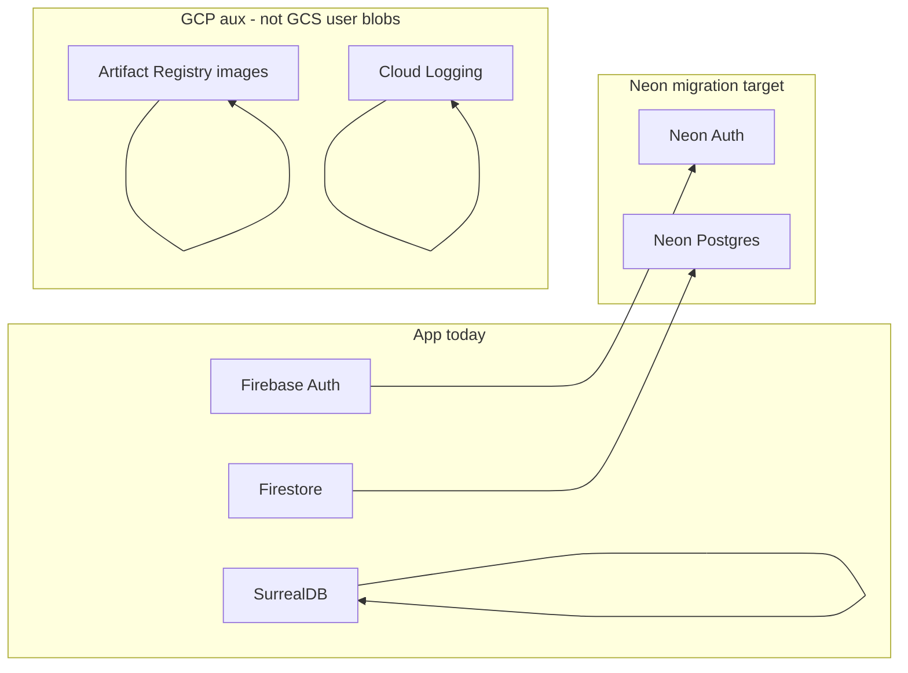

# GCP storage scope for Neon migration

**Full migration review (Neon + GCP exit + hosting):** [`gcp-exit-unified-migration-review.md`](gcp-exit-unified-migration-review.md) — open in the IDE from `docs/sophia/`.

**Repo copy of the Cursor plan** `gcp_storage_vs_neon_plan_af2cbfc8.plan.md` (see also **Cursor Plans** in the IDE: the canonical file lives under your user `.cursor/plans/` directory and is not committed).

## Application runtime: no GCS / Firebase Storage

- **Firebase Storage** is not imported or used anywhere (no `firebase/storage`, no `getStorage`).
- **Direct GCS usage** in TypeScript/JavaScript: none. The only `@google-cloud/*` dependency declared in [`package.json`](../../package.json) is **`@google-cloud/logging`**, used by [`src/lib/server/cloud-logger.ts`](../../src/lib/server/cloud-logger.ts) for **Cloud Logging**, not object storage.
- **`@google-cloud/storage`** appears in the lockfile as a **transitive** dependency (not a first-class app dependency); there are **no** `import` sites in `src/` or `scripts/`.

So the **Neon + Neon Auth** migration does **not** need to replace an existing “files in GCS” or “Firebase Storage” layer in this repo.

## Operational / docs: GCS for Firestore backups only

- Archived docs (e.g. [`docs/archive/delivery/migration-quickstart.md`](../archive/delivery/migration-quickstart.md), [`docs/archive/delivery/gcp-org-migration.md`](../archive/delivery/gcp-org-migration.md)) describe **`gsutil` + `gcloud firestore export`** to a bucket such as `gs://sophia-firestore-backups` — **backup/migration procedure**, not application reads/writes.
- **Include in the Neon plan only if** you want a **documented cutover** for backups: e.g. after moving off Firestore, use **Neon’s backup/PITR** (or your own `pg_dump` to an object store of choice). That is **optional** and separate from app code; you could keep or retire the GCS bucket used only for Firestore exports.

## GCP infra: what is “storage-like” but not user data

From [`infra/index.ts`](../../infra/index.ts) (and `bin/index.js`):

| Resource | Role |
| -------- | ---- |
| **Artifact Registry** (`gcp.artifactregistry.Repository`) | Stores **Docker images** for Cloud Run (app + ingest). Stays relevant as long as you deploy on GCP; **not** replaced by Neon. |
| **Firestore** (`roles/datastore.user` on the app SA) | **Database** access for `firebase-admin` Firestore — this **is** in scope for moving **data** to Neon Postgres, but it is **not** GCS. |
| **Cloud Logging** (`roles/logging.logWriter`) | Logs, not blobs. |

No Pulumi-managed **Cloud Storage bucket** for app data appears in the infra files reviewed.

## Recommendation for the overall migration plan

- **Do not** fold “migrate GCS app storage” into the Neon workstream — there is no such layer in code today.
- **Optionally** add a **short backup/DR subsection**: retire Firestore-export-to-GCS playbooks once Firestore is gone; rely on Neon (and, if desired, external dump targets).
- **Keep separate** any future decision about **binary/file uploads** (if product needs them): that would be new design (e.g. S3-compatible, or GCS), not a migration of existing usage.

## Follow-ups (optional)

- Treat GCS/Firebase Storage as out of scope for Neon migration unless new file-upload product requirements appear.
- Optional: update ops docs to replace Firestore-export-to-GCS with Neon backup / `pg_dump` strategy after cutover.
